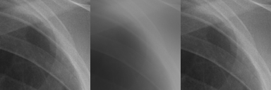
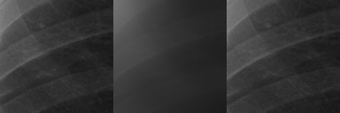
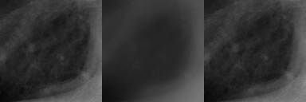
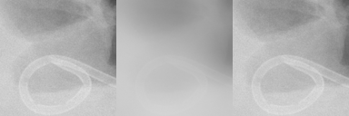

# tfg-cnn

PyTorch implementation of a convolutional neural network for scatter correction in chest x-rays.

## Dependencies

* torch==1.11.0
* torchvision==0.12.0
* numpy==1.22.3
* opencv_python==4.5.5.64

## Dataset

NIH Chest X-ray dataset: https://nihcc.app.box.com/v/ChestXray-NIHCC

## Usage

### Training example

```
python3 train.py --epochs 20 --patch-size 128 --learning-rate 1e-4 dataset/train
```

### Testing example

```
python3 eval.py --patch-size 128 --patch-stride 64 trained.pth dataset/test
```

## Examples
* Left: ground truth (no scatter)
* Middle: input (with scatter)
* Right: output/prediction (scatter corrected)









